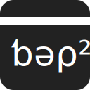

<!-- top centered logo with link to web page -->
<p align="center">
    <a href="src/index.html">
        
    </a>
</p>

**Welcome on the ƅǝρ² — say *bep* — Git repository!**

~The project is stable, ready for production and the website is accessible at [http://www.bep.com]()!~

:construction: work in progress... :construction:

***

## Working with this repository

### Clone the repository

To clone this repository on your local computer please run:
```bash
$ git clone https://github.com/PierreGuilmin/bep.git
```

### Commit code

Please use the following table to commit code:

| emoji        | meaning        | code           |
| :----------: | :------------- | :------------- |
| :sos:        | critical bug   | `:sos:`        |
| :warning:    | bug            | `:warning:`    |
| :eyes:       | to check       | `:eyes:`       |
| :flashlight: | simplification | `:flashlight:` |
| :sparkles:   | typos & style  | `:sparkles:`   |
| :tada:       | new feature    | `:tada:`       |

For example if you want to commit a new rocket feature — `🎉 new feature, flying rocket!` — please do:
```diff
# bad syntax
- $ git commit -m 'new feature, flying rocket!'

# good syntax
+ $ git commit -m ':tada: new feature, flying rocket!'
```

## Repository structure

- **`misc/`**: miscellaneous files, temporary files, drafts, ideas, exploratory work, trash can, platypus, grandma belt and everything in between.
  > :warning: This folder should not be versionned.

- **`src/`**: the website source code.
