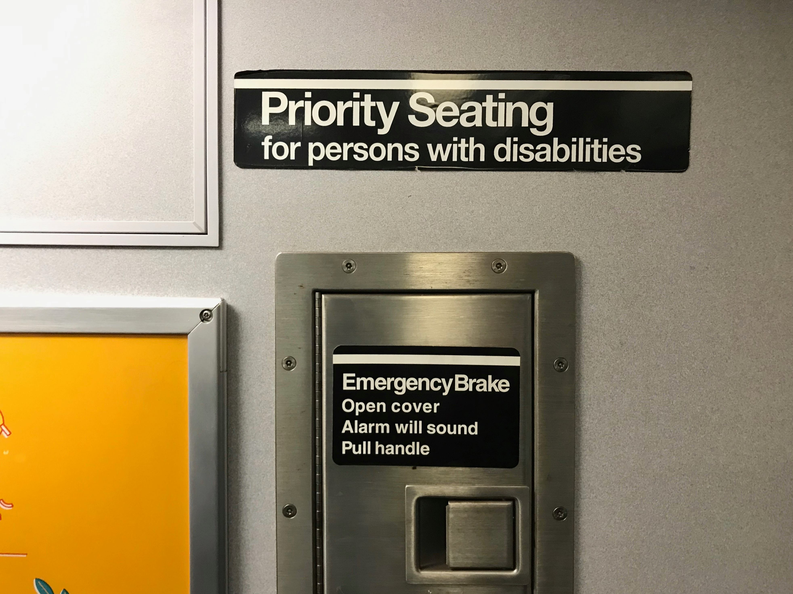

# Resources

### Images source
- `bep_icon/`: personal work, inspiration came from the New-York subway this morning (see picture under). Images were converted from `.png` to `.ico` with https://cloudconvert.com/.
- `mail_icon/`:
    - `mail_icon_inspiration_1.svg` & `mail_icon_inspiration_2.svg`: https://www.iconfinder.com/
    - `mail_icon.svg` & `mail_icon_128px.png`: personal work
- `messenger_icon/`: https://en.facebookbrand.com/assets/messenger/
- `whatsapp_icon/`: https://whatsappbrand.com/
- `github_icon_120px.png`: https://github.com/logos
- `team_picture.jpg`: personal picture

### New-York subway morning inspiration for the ƅǝρ² logo (personal picture)

    

